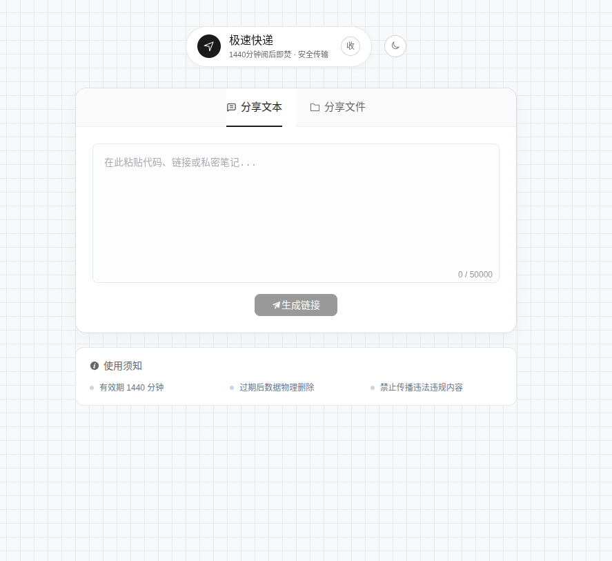
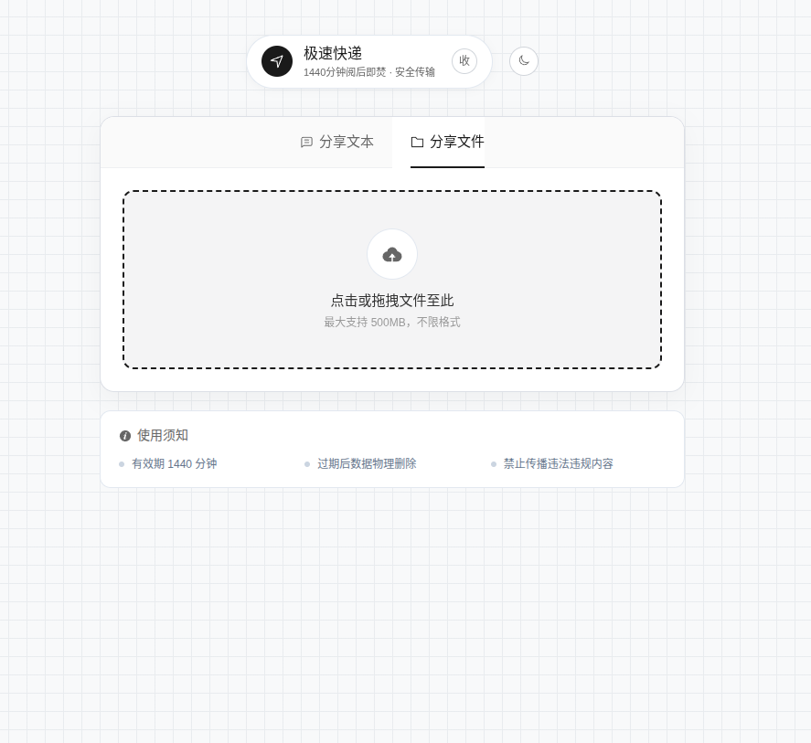
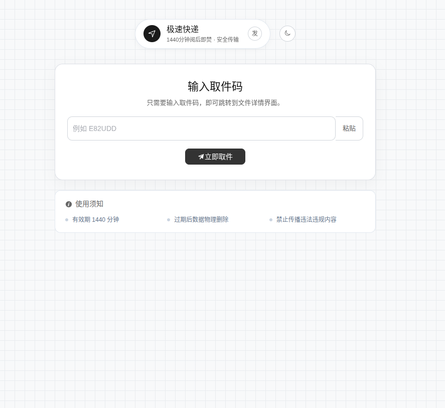
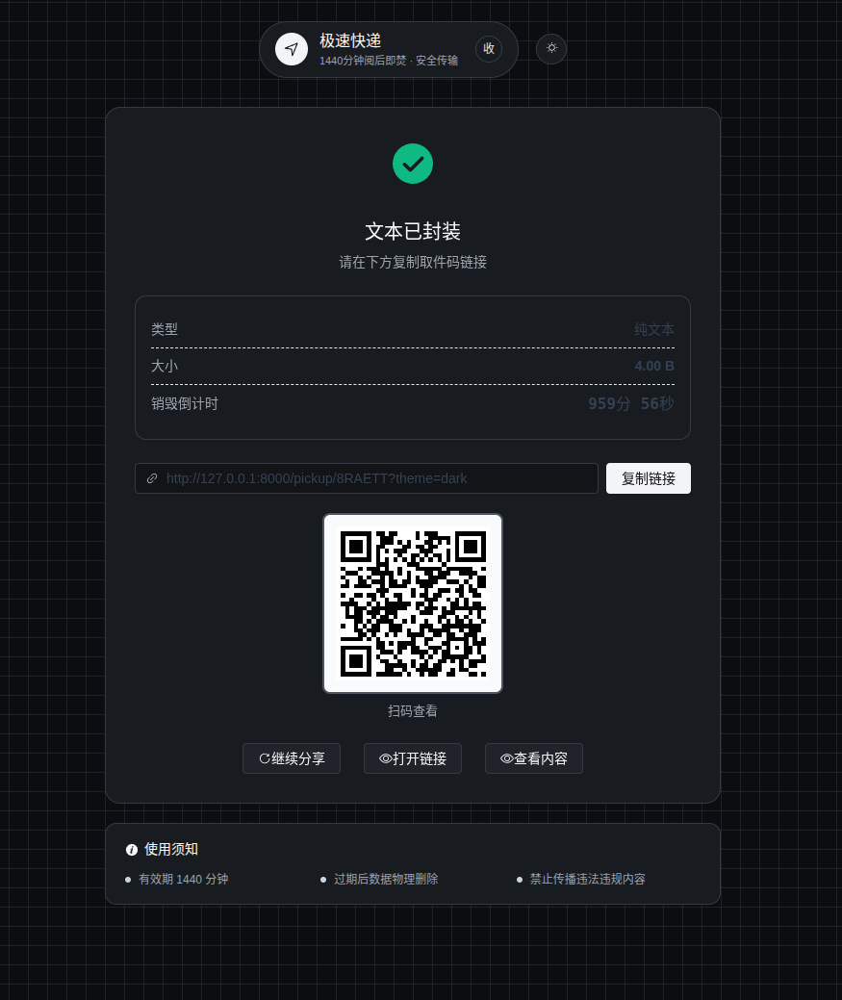
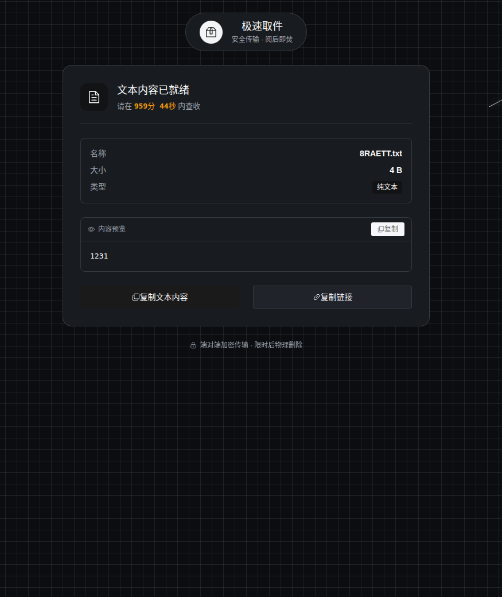

<h1 align="center">千秋文件快递柜</h1>

<p align="center">
  
</p>

<p align="center"><strong>一个简洁的临时文件快递柜</strong></p>

<p align="center">
  支持文本分享、文件上传、二维码取件，内容默认保留 24 小时，适合个人部署后直接使用。
</p>

<h2 align="center">界面预览</h2>

<p align="center">
  
  
</p>

<p align="center">
  
  
</p>

<p align="center">
  
</p>

## Docker 部署

### 1. 拉取镜像

```bash
docker pull yyy887/file-cabinet:latest
```

### 2. 启动服务

```bash
docker run -d \
  --name file-cabinet \
  --restart unless-stopped \
  -p 8000:8000 \
  -v $(pwd)/data:/app/backend/data \
  -e APP_NAME="Qianqiu File Cabinet" \
  -e DATABASE_URL="sqlite:///./data/app.db" \
  -e STORAGE_DIR="data/storage" \
  -e KEEP_HOURS="24" \
  -e CLEANUP_INTERVAL_MINUTES="30" \
  -e PUBLIC_BASE_URL="http://127.0.0.1:8000" \
  yyy887/file-cabinet:latest
```

### 3. 打开页面

```text
http://127.0.0.1:8000
```

## 常用命令

### 查看状态

```bash
docker ps
```

### 查看日志

```bash
docker logs -f file-cabinet
```

### 停止

```bash
docker stop file-cabinet
```

### 启动

```bash
docker start file-cabinet
```

### 重启

```bash
docker restart file-cabinet
```

### 删除

```bash
docker rm -f file-cabinet
```

## 更新镜像

```bash
docker pull yyy887/file-cabinet:latest
docker rm -f file-cabinet
docker run -d \
  --name file-cabinet \
  --restart unless-stopped \
  -p 8000:8000 \
  -v $(pwd)/data:/app/backend/data \
  -e APP_NAME="Qianqiu File Cabinet" \
  -e DATABASE_URL="sqlite:///./data/app.db" \
  -e STORAGE_DIR="data/storage" \
  -e KEEP_HOURS="24" \
  -e CLEANUP_INTERVAL_MINUTES="30" \
  -e PUBLIC_BASE_URL="http://127.0.0.1:8000" \
  yyy887/file-cabinet:latest
```

## 提示

- 数据会保存在当前目录的 `data/` 中。
- 如果你要公网访问，把 `PUBLIC_BASE_URL` 改成你的域名或服务器 IP。
- 如果端口被占用，把 `-p 8000:8000` 改成别的端口，例如 `-p 9000:8000`。

<h2 align="center">Star 趋势</h2>

<p align="center">
  
</p>

<p align="center">
  GitHub 仓库地址：<code>YYY887/file-send-easy</code>
</p>
